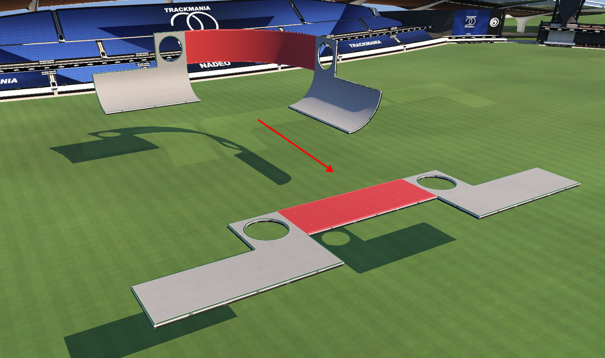
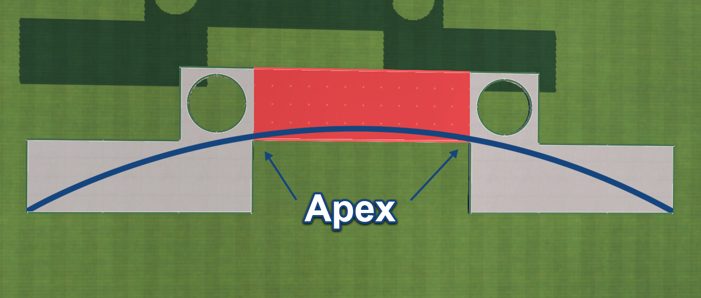

A wallride is a basic feature that connects two quarter pipe blocks together with a curved, vertical wall. Similar to the loop, wallrides are best driven from apex to apex, staying as low as possible. This means you want to enter the wall at the corner where the bottom of the wall meets the top of the quarter pipe.

Unwrapping the wall ride we can see the shortest path through a wall is staying straight and low. The highest point on a correctly driven wall should be right in the center of the wall block. It can be easy for beginners to go too high on walls, but it is best to set up for a wall with the follow through and exit in mind. This means you almost never want to be steering up a wall, only gentle steering inputs going down to help you hit the exit apex. 

In modern fullspeed maps, you will often come across wallride helpers in the corner between the quarter pipe and wall block. These make hitting the correct apex much easier. However, on certain occasions the helper is unnecessary, as it is possible that using it will force you higher on the wall than necessary. That said, when you come across a helper it is best practice to use it as it will help you stay nice and low on the wall.

If you’re up for the task of bruteforce learning how to drive wall rides correctly, I recommend the map [Kindheitstrauma 2020](https://trackmania.exchange/s/tr/25) This map is 45 seconds of almost exclusively wallrides, GLHF.
