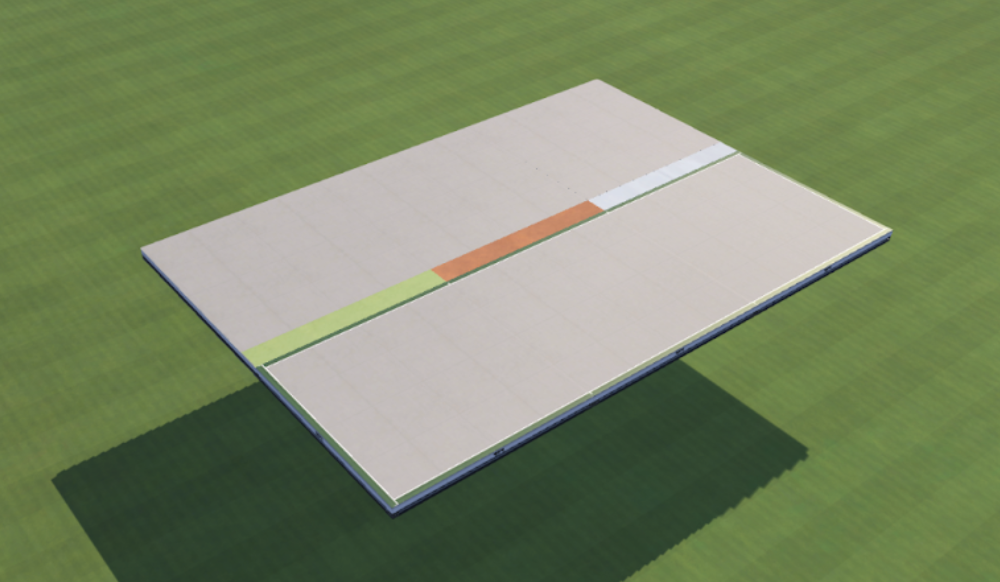
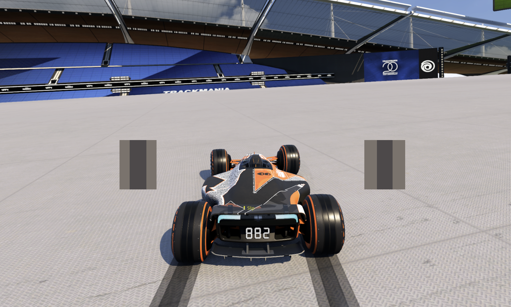

## How to start a speed drift
There are a few ways mappers build SD’s into their maps. One common way you’ll often see on easier maps is with a stripe of a slippery surface like grass, dirt, plastic, or ice. These are often put at the beginning or end of a turn to force the car into a slide. From here it is up to the driver to react to the loss of grip and try to hold the slide as long as they can through the section into the next feature.

You can also start a slide on road with one of two techniques: An autoslide or an S4D. 

## Autoslide
An autoslide can be initiated on road when the car is above 600 speed by full-steering for about half a second. At or above this speed, any slight elevation change in the road can be used to help start a slide.

Another common way to start an SD at this speed is with any jump. At the exit of a ramp or platform drop, you can do a small, precise steering input at the end of the block to set the car up to land in an SD.

There are many speed drift practice maps out there, most popularly [FS Training | Speed Drift](https://trackmania.exchange/s/tr/3628) from Mudda. Additionally, the “Fullspeed Training” campaign from the monkaSTEER Community club in-game has a collection of different SD practice maps, along with other fullspeed practice maps like loops, walls, etc.

## S4D
The second way to start an SD on road is with the technique known as an S4D. To perform an S4D you do a very quick brake tap to start the slide. The name of this is often incorrectly credited as being “Stop 4 Drift” or “Speed 4 Drift”. While that does technically make sense, the name actually comes from the inventor of the trick by a member of the team R4B and is named after that team. 

The set of inputs needed for an S4D is very similar to a tech drift, except you want as quick of a brake tap as possible so you lose as little speed as possible. S4D’s are more advanced than a normal autoslide, so you don’t usually see them outside of more advanced maps, but the main benefit they provide is being able to start a slide before the 600 speed threshold for an autoslide. This means you can S4D with speed as low as 420 to begin a speed slide on road. However, you must account for the speed loss from using the brake, so an S4D is often not worth it unless you can carry the SD for more than a second. This coupled with the fact that low speed SD’s like this are tough to hold the correct angle of, S4D’s are not a very popular trick on most maps, but worth learning for specific use cases. If you want to practice S4D’s I would recommend the Trackmania School practice map “TMS - Speed 4 Drift” or [Spring Day](https://trackmania.exchange/maps/65133/fms-spring-day) by DontCare.

## How to hold a speed drift
While starting an SD is important, the ability to hold an SD, and the quality of the SD is what separates good players from great players. There are two main techniques for carrying out long SD’s: tapping and holding. Ultimately it comes down to personal preference for which method is best for you. 

For both tapping and holding there are some general best practices to follow. This is covered in more detail in the Skids Overlap section, but the general rule on flat road is to increase the skid overlap as your speed increases. 

## Where to Look
Maybe the most awkward aspect for new players of fullspeed is the constant need to look behind the car when driving. As mentioned in the Fullspeed Basics section, do not think about SD’s at all as a new driver. You will gain much more time from well driven features than attempting a bad SD. Focusing on clean lines and minimizing steering is textbook technique to build off of and will help you immensely down the line when you start incorporating slides. 

That said, when you are starting to build the skill of speed drifts it is first helpful to be very familiar with the layout of the track. Spend considerable time hunting a single map so you know exactly what to expect with each turn. Then you can start focusing on watching behind the car. Not every SD requires you to stare down the overlap, but with longer slides you have more time to focus on them and can trust the map will take you in the right place with a good slide. When staring down your overlap on a long SD, it is best practice to look at your outside skids, (right side when sliding left and vice versa) as that will be more accurate to the target SD overlap chart. This is a _very_ minor detail, but as shown below it can make a slight difference at high speeds.

With experience you will be able to ‘feel’ the correct SD overlap needed and you will find your eyes focusing more on the front of the car, watching your overlap in your peripheral vision while simultaneously looking ahead. 

## Uphill & Downhill
When you are going downhill you want more overlap than when you are going uphill. This is because the target skid overlap is related to the amount of grip you have with the surface. So when you are driving uphill you are fighting against gravity and there is more downforce on the car, thus more grip, which in turn requires less overlap. 

The opposite is also true, downhill = less grip = more overlap. It starts to click when you compare the SD overlap needed for grass/dirt/plastic; surfaces that have far less grip than road, as such require much more overlap due to this lack of grip. This can be further applied to special blocks like magnet or reactor boost down, as driving over them increases the amount of grip the car has with the surface. These will be covered more in depth in the Advanced Techniques section later on.

## Tapping
As the name suggests, tapping an SD requires a consistent set of steering taps to carry and extend the slide of an SD. This is usually seen as the easier way to SD, as you don't need as much built up muscle memory to hold the stick at a specific angle. This tapping is like a rhythm and can be self corrective in a way. There is no way to hold a perfect SD tap, as you are constantly doing very small over and under-slides, but these balance out over time to give a good quality SD. On the flip side, with holding you can _technically_ perform a perfect hold, but it’s very difficult and essentially impossible throughout a real map, so a constantly underslid hold SD will produce a lower quality SD than the constant variation in slide angle from tapping. 

## Holding
As the name suggests, holding SD’s requires you to hold a consistent, solid slide angle throughout the entirety of the SD. This can only be done on analog devices such as a controller, wheel, joystick, etc. For holding on a controller, you have a choice of stick to use, right or left. Notoriously, the player Chroma uses the right stick to hold SD’s and is considered as having one of, if not the best, quality SD’s. While you’re probably used to left stick steering, I would suggest you try out using each stick to see what feels best for you on some SD practice maps. It can help to not steer directly right/left, but rather use the edge of the stick housing to help perform more precise hold angles. 


